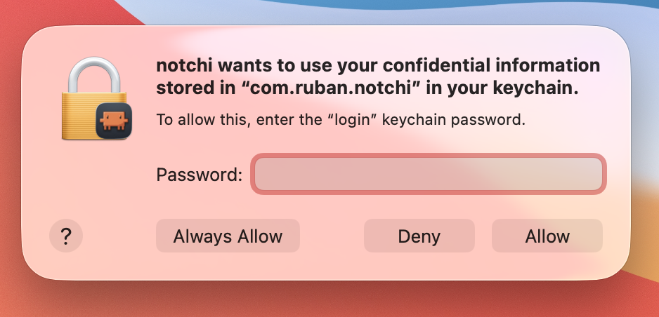

# Notchi

一款 macOS 刘海屏伴侣应用，能够实时响应 Claude Code 的活动。

https://private-user-images.githubusercontent.com/65346010/560062558-e417bd40-cae8-47c0-998a-905166cf3513.mp4?jwt=eyJ0eXAiOiJKV1QiLCJhbGciOiJIUzI1NiJ9.eyJpc3MiOiJnaXRodWIuY29tIiwiYXVkIjoicmF3LmdpdGh1YnVzZXJjb250ZW50LmNvbSIsImtleSI6ImtleTUiLCJleHAiOjE3NzMxMDAwNzAsIm5iZiI6MTc3MzA5OTc3MCwicGF0aCI6Ii82NTM0NjAxMC81NjAwNjI1NTgtZTQxN2JkNDAtY2FlOC00N2MwLTk5OGEtOTA1MTY2Y2YzNTEzLm1wND9YLUFtei1BbGdvcml0aG09QVdTNC1ITUFDLVNIQTI1NiZYLUFtei1DcmVkZW50aWFsPUFLSUFWQ09EWUxTQTUzUFFLNFpBJTJGMjAyNjAzMDklMkZ1cy1lYXN0LTElMkZzMyUyRmF3czRfcmVxdWVzdCZYLUFtei1EYXRlPTIwMjYwMzA5VDIzNDI1MFomWC1BbXotRXhwaXJlcz0zMDAmWC1BbXotU2lnbmF0dXJlPWZkMmE3Y2Q4OWY0NzEwNWIxNjVhZTViMmIwNTZiNTE1MGI3MzE5Mjk4ZTVlMmIyMTQ4MGM4OTdjZThlOTRjZDMmWC1BbXotU2lnbmVkSGVhZGVycz1ob3N0In0.__SV_Ny9jUTIbfMwXdWw0ELAuDhcTzNJ7iPT-R1wC8s

## 功能介绍

* 实时响应 Claude Code 事件（思考中、工作中、错误、完成）
* 分析对话情感，展示不同表情（开心、难过、中立、崩溃）
* 点击展开刘海屏，查看会话用量统计
* 支持多个并发 Claude Code 会话，每个会话拥有独立精灵
* 事件音效提示（可选，终端聚焦时自动静音）
* 通过 Sparkle 框架自动更新

## 安装

1. 从[最新 GitHub Release](https://github.com/NotchiClaude/notchi-bsc/tree/main) 下载 `Notchi-x.x.x.dmg`
2. 打开 DMG 文件，将 Notchi 拖入「应用程序」文件夹
3. 启动 Notchi — 首次启动时会自动安装 Claude Code 钩子
4. macOS 钥匙串会弹出请求访问 Claude Code 缓存的 OAuth 令牌（用于 API 用量统计）。点击 **始终允许**，后续启动不再弹出

   [](assets/keychain-popup.png)
5. （可选）点击刘海屏展开 → 打开设置 → 粘贴你的 Anthropic API 密钥。启用后精灵会根据你的提示情感做出情绪反应

   [](assets/emotion-settings.png)
6. 开始使用 Claude Code，观察 Notchi 的实时反应

## 系统要求

* macOS 15.0+（Sequoia）
* 带刘海屏的 MacBook
* 已安装 [Claude Code](https://docs.anthropic.com/en/docs/claude-code)

## 工作原理

```
Claude Code --> 钩子（Shell 脚本）--> Unix 套接字 --> 事件解析器 --> 状态机 --> 动画精灵
```

Notchi 在启动时向 Claude Code 注册 Shell 脚本钩子。当 Claude Code 发出事件（工具调用、思考中、提示、会话开始/结束），钩子脚本会将 JSON 数据包发送至 Unix 套接字。应用解析这些事件，通过状态机将它们映射为精灵动画（空闲、工作中、休眠、压缩中、等待中），并利用 Anthropic API 分析用户提示的情感，驱动精灵做出情绪反应。

每个 Claude Code 会话在草地小岛上拥有独立的精灵。点击刘海屏可展开面板，查看实时活动日志、会话信息和 API 用量统计。

## 鸣谢

* [Claude Island](https://github.com/farouqaldori/claude-island)
* [Readout](https://readout.org)

## 开源协议

MIT
